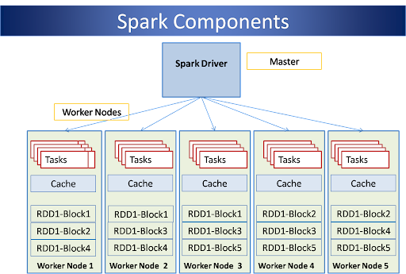

# CSCI596Project

# Overview

## Background
Each year there are about 189,200 openings for software engineering related jobs, according to the data from U.S. Bureau of Labor Statistics [1]. Different positions may expect candidates with different experience and technical skills. In this case, as applicants, we want to know whether our skills are matched with the requirements of some specific positions by scanning their job descriptions. 

## Spark

Apache Spark is a lightning-fast cluster computing designed for fast computation. Spark processes data in RAM using a concept known as an RDD, Resilient Distributed Dataset.

Spark makes it easy to combine different processing models seamlessly in the same application, such as data classification with machine learning library, streaming data via Spark Streaming and data query through Spark SQL.

Spark is built on top of the Scale programming language but we can use the Python API for running Spark (PySpark). 

## Scope

- Setup a proxy server and fetch job information from Adzuna job API when a client requests the server. 
- Utilize Spark Machine Learning library as the parallel processing tool to extract keywords from a list of job descriptions. 
- Calculate the matching gap between keywords provided by the client and the keywords extracted from the list.
- Return a list of matching results to the client. 

[1] https://www.bls.gov/ooh/computer-and-information-technology/software-developers.htm
